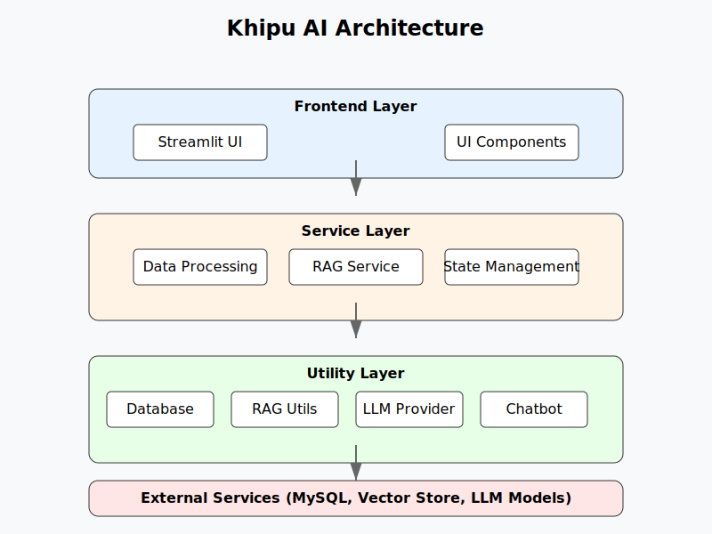

# 🧮 Khipu AI

Un asistente de análisis de datos impulsado por IA que permite consultar bases de datos MySQL usando lenguaje natural. Este proyecto combina LangChain, RAG (Retrieval Augmented Generation) y modelos de lenguaje para traducir preguntas en lenguaje natural a consultas SQL y presentar resultados de manera interactiva.

## 🌟 Características Principales

- **Procesamiento de Lenguaje Natural**: Convierte preguntas en lenguaje natural a consultas SQL usando LangChain y modelos LLM
- **Compatibilidad Universal con Datasets**: Funciona con cualquier conjunto de datos estructurado en MySQL
- **RAG (Retrieval Augmented Generation)**: Mejora las respuestas utilizando documentación y contexto específico del dominio
- **Soporte Multi-LLM**: Compatibilidad con múltiples proveedores de LLM (OpenAI, Ollama)
- **Interfaz Interactiva**: Interfaz limpia e intuitiva construida con Streamlit
- **Visualización Inteligente**: Generación automática de gráficos basados en resultados de consultas
- **Soporte Multilingüe**: Responde en el mismo idioma de la pregunta
- **Herramientas de Debug**: Panel de depuración y sistema de logging integrado

## 🏗️ Arquitectura

La arquitectura de Khipu AI está diseñada para ser modular, extensible y fácil de mantener:



### Componentes Principales:

1. **Frontend Layer**:
   - UI basada en Streamlit
   - Componentes reutilizables para visualización y entrada de datos
   - Gestión de estado de la aplicación

2. **Service Layer**:
   - Data Processing Service: Manejo principal de consultas y respuestas
   - RAG Service: Mejora de respuestas con contexto adicional
   - State Management: Gestión del estado de la aplicación

3. **Utility Layer**:
   - Database Utils: Interacción con MySQL
   - RAG Utils: Manejo de documentos y embeddings
   - LLM Provider: Abstracción para diferentes proveedores de LLM
   - Chatbot Utils: Procesamiento de consultas y respuestas

4. **External Services**:
   - MySQL Database: Almacenamiento principal de datos
   - Vector Store: Almacenamiento de embeddings para RAG
   - LLM Models: Modelos de lenguaje (OpenAI/Ollama)

## 💡 Cómo Funciona RAG en Khipu AI

El sistema RAG (Retrieval Augmented Generation) mejora la calidad de las respuestas incorporando conocimiento específico del dominio:

1. **Indexación de Documentos**:
   - Los documentos relevantes se cargan desde el directorio `/docs`
   - Se procesan y dividen en chunks manejables
   - Se generan embeddings usando OpenAI
   - Se almacenan en una base de datos vectorial FAISS

2. **Proceso de Consulta**:
   - La pregunta del usuario se convierte en un embedding
   - Se recuperan los documentos más relevantes de FAISS
   - El contexto recuperado se combina con la pregunta original
   - Se genera una respuesta mejorada usando el LLM

3. **Beneficios**:
   - Respuestas más precisas y contextualizadas
   - Mejor comprensión del dominio específico
   - Reducción de alucinaciones del modelo
   - Capacidad de incorporar conocimiento especializado

## 🛠️ Stack Tecnológico

- **Backend**: Python 3.8+
- **Frontend**: Streamlit
- **AI/ML**:
  - LangChain
  - OpenAI/Ollama
  - FAISS Vector Store
- **Base de Datos**: MySQL
- **Procesamiento de Datos**:
  - Pandas
  - NumPy
- **Visualización**:
  - Matplotlib
  - Seaborn

## 📋 Requisitos

- Python 3.8 o superior
- MySQL Server
- OpenAI API key (opcional si usa Ollama)
- Ollama (opcional si usa OpenAI)
- Git

## 🚀 Instalación

1. **Clonar el Repositorio**:
```bash
git clone https://github.com/ronaldmego/khipu_ai.git
cd khipu_ai
```

2. **Ejecutar Script de Setup**:
```bash
python scripts/setup.py
```

3. **Configurar Variables de Entorno**:
Crear archivo `.env` en la raíz del proyecto:
```env
# LLM Provider Configuration
DEFAULT_LLM_PROVIDER=ollama
DEFAULT_TEMPERATURE=0.7

# OpenAI Configuration (opcional)
OPENAI_API_KEY=your_key_here

# Ollama Configuration
OLLAMA_BASE_URL=http://localhost:11434

# MySQL Configuration
MYSQL_USER=your_user
MYSQL_PASSWORD=your_password
MYSQL_HOST=your_host
MYSQL_DATABASE=your_database
```

## 📚 Configuración de RAG

1. **Preparar Documentos**:
   - Coloca tus documentos relevantes en el directorio `/docs`
   - Formatos soportados: .txt, .md, .pdf

2. **Estructura de Documentos**:
```
docs/
├── time_series_handling.md
├── database_schema.md
└── business_rules.pdf
```

3. **Consideraciones**:
   - Usa documentos concisos y relevantes
   - Organiza la información de manera clara
   - Actualiza los documentos según sea necesario

## 💻 Uso

1. **Iniciar la Aplicación**:
```bash
streamlit run src/pages/Home.py
```

2. **Configurar la Base de Datos**:
   - Selecciona las tablas a consultar
   - Verifica la conexión en el panel de debug

3. **Realizar Consultas**:
   - Escribe preguntas en lenguaje natural
   - Observa las consultas SQL generadas
   - Analiza las visualizaciones automáticas

## 🤝 Contribuir

1. Fork el repositorio
2. Crea tu rama de feature
3. Commit tus cambios
4. Push a la rama
5. Crea un Pull Request

## 📄 Licencia

Este proyecto está licenciado bajo MIT License - ver [LICENSE](LICENSE) para más detalles.

## 👥 Autor

**Ronald Mego**
- [Portfolio](https://ronaldmego.github.io/)
- [GitHub](https://github.com/ronaldmego)

---

Para más información y actualizaciones, visita el [repositorio del proyecto](https://github.com/ronaldmego/khipu_ai).